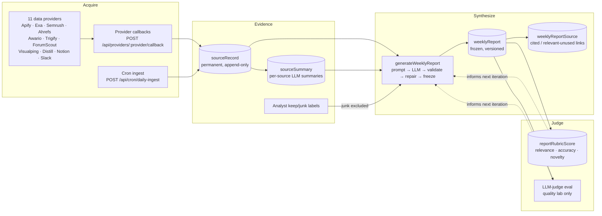
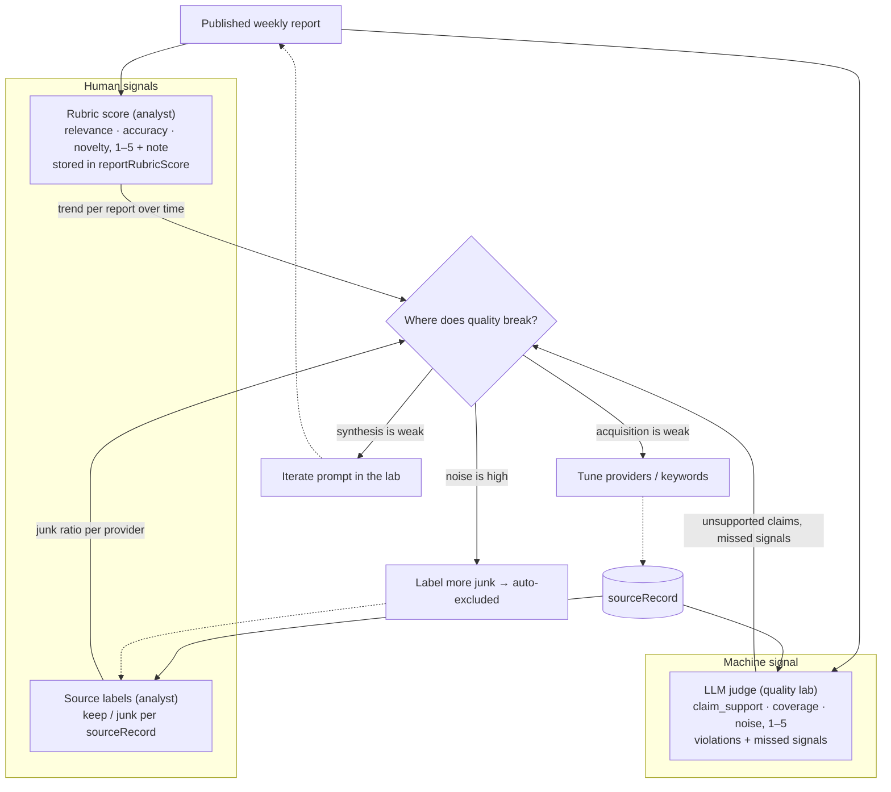
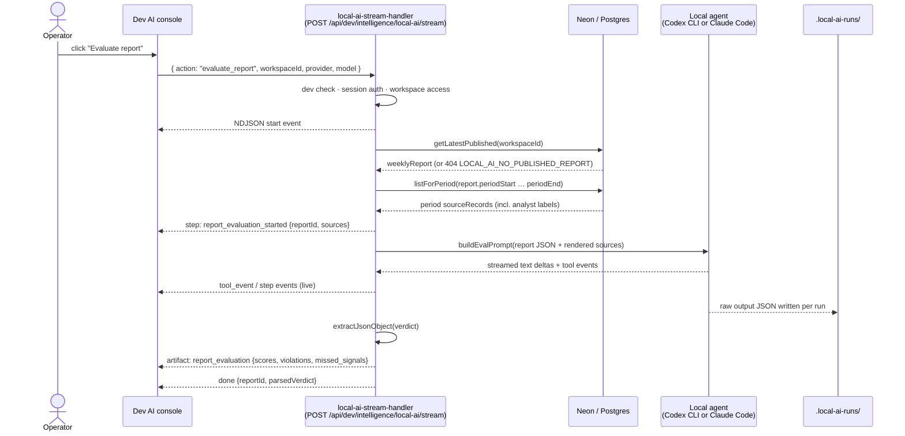
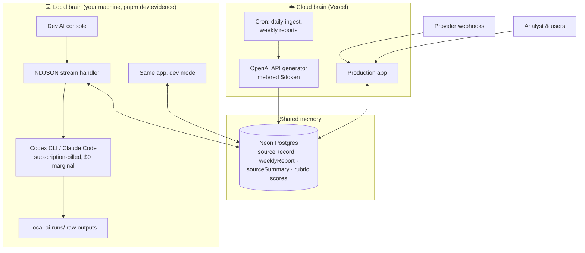
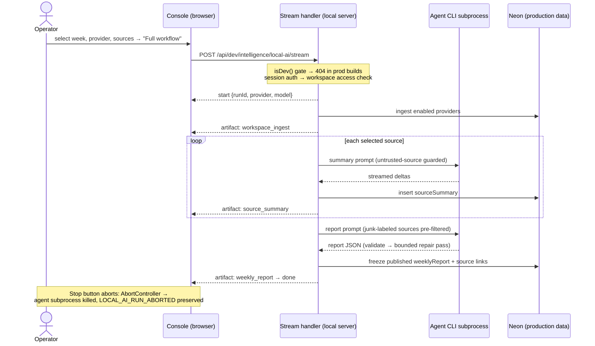

# Raffy Research

Raffy Research is a market-intelligence pipeline with a web app on top. It continuously acquires raw market evidence from external data providers, normalizes everything into auditable **source records**, and synthesizes a weekly intelligence report per workspace using an LLM. An analyst works the data: reading reports, tracing claims back to sources, labeling which sources were worth keeping, and scoring each report on a rubric — so the pipeline's quality is **measured**, not assumed.

The product thesis in one sentence: **a quality pipeline for acquiring information and synthesizing evidence, operated by an analyst.** Everything in this repository serves one loop:

```
steer (topics/questions) → ingest (providers) → assess evidence → read synthesis → judge quality → the system improves
```

---

## Table of Contents

1. [High-Level Overview](#high-level-overview)
2. [Operator Guide](#operator-guide)
3. [Technical Details](#technical-details)
4. [Evals: The Quality Loop](#evals-the-quality-loop)
5. [Split-Brain Mode](#split-brain-mode)
6. [Development Reference](#development-reference)

---

## High-Level Overview

### What the system does



* **Acquisition.** External providers push results through authenticated webhook callbacks; scheduled cron jobs trigger pull-based ingestion. Every payload is normalized into a `sourceRecord` — duplicates intentionally allowed, raw payloads preserved for audit.
* **Synthesis.** Once a week (or on demand), the system gathers a workspace's period sources, configured keywords/competitors/social accounts, prior reports, and optional per-source summaries, builds a versioned prompt, and generates a structured JSON report. Output is schema-validated with a single bounded repair pass; published reports are frozen and append-versioned.
* **Judgment.** The analyst scores each report on a three-dimension rubric, labels sources keep/junk (junk is excluded from future generation), and can run an adversarial LLM judge in the local quality lab that checks every report claim against the underlying sources.

### Who uses it

| Role | Surface | What they do |
|---|---|---|
| Analyst | `/app` | Reads the latest report, traces evidence to sources, labels sources keep/junk, scores reports on the rubric |
| Manager/admin | `/manager` | Manages users and workspaces, inspects provider callbacks and report history |
| Operator (you) | Dev AI console + evidence mode | Iterates on the pipeline locally against production data using subscription-billed local agents (see [Split-Brain Mode](#split-brain-mode)) |

### The five modules

| Module | Purpose |
|---|---|
| `intelligence` | The product: sources, reports, rubric scores, providers, generation, ingestion, local AI lab |
| `auth` | Better Auth email/password sessions, roles, permission checks |
| `user` | User administration (list/create/update/revoke) |
| `account` | Self-service account settings |
| `kernel` | Cross-cutting: branded IDs, `AppError`/`Result` outcomes, Drizzle DB layer, OTel observability, runtime config |

---

## Operator Guide

### First-time setup (local, isolated)

```bash
cp .env.example .env  # Set env variables
pnpm install          # Install dependencies
pnpm dk:init          # Start Docker containers (PostgreSQL, MinIO)
pnpm db:init          # Push the Drizzle schema and seed the database
pnpm dev              # Run the app
```

The seed creates one workspace with a published example report. Sign in at `/login` (signup is disabled by design; use `pnpm auth:set-credential` to set a password for a seeded user).

### Day-to-day analyst workflow

1. **Read the report.** `/app` shows the workspace's latest published report: executive summary, "what looks most interesting," contradictions, topic clusters, competitor watch, market questions, possible leads, social/product feedback, and the source library.
2. **Trace claims.** Every evidence row has an *Open source* button; the Source Library lists every linked source with a `Cited` / `Relevant` badge. The source sheet shows content, diffs (added/removed text for monitored pages), and the internal source reference.
3. **Label sources.** In any source view, answer *"Is this source worth keeping?"* with **Keep** or **Junk** (clicking again clears the label). Junk-labeled sources are excluded from all future report generation for that workspace and the exclusion count is logged per run.
4. **Score the report.** At the bottom of every report, the **Score this report** panel asks for 1–5 on three dimensions, plus an optional note:
   * **Relevance** — does this report cover what matters to us this week?
   * **Accuracy** — are the claims faithful to the underlying sources?
   * **Novelty** — did it tell us something we did not already know?

   One score per report per user; re-scoring replaces your previous score, and the row history accumulates one judgment per report so quality can be tracked over time.

### Manager workflow

* `/manager/workspaces` → workspace detail shows company config, keywords, competitors (with suggested/accepted state), provider configs, internal note configs, report history with status badges, and the raw provider callback log.
* `/manager/users` handles user administration.
* In development builds, the workspace page also shows the **Local AI console** (see below).

### Dev AI console (development only)

On `/manager/workspaces/:id` when `DEV` is true. Controls:

| Control | Effect |
|---|---|
| Week date | Anchor date; the system computes the workspace-timezone Monday–Sunday period |
| Provider | `codex-cli` or `claude-code` |
| Model | Optional override; empty uses the `LOCAL_AI_MODEL` env default |
| **Load sources** | Lists the period's source records and selects them all |
| **Ingest enabled** | Runs all enabled provider ingestion for the workspace |
| **Reprocess callbacks** | Re-runs normalization for selected raw callbacks |
| **Summarize sources** | One LLM call per selected source → stored `sourceSummary` rows |
| **Generate report** | Full generation against the selected sources |
| **Evaluate report** | LLM-judge pass over the latest published report ([details](#the-llm-judge-evaluate_report)) |
| **Full workflow** | Ingest → reprocess → summarize → generate in one run |
| **Stop** | Aborts the in-flight run (the abort reason is preserved end-to-end) |

Every run streams NDJSON events into the run log, and every model call writes its raw output to `.local-ai-runs/` (gitignored) for post-hoc inspection.

### Scheduled production jobs

| Endpoint | Schedule intent | Auth |
|---|---|---|
| `POST /api/cron/daily-ingest` | Daily provider ingestion | `CRON_SECRET`, constant-time comparison, checked before body parsing |
| `POST /api/cron/weekly-reports` | Weekly report generation for every workspace | same |
| `POST /api/providers/:provider/callback` | Provider webhooks, any time | `PROVIDER_WEBHOOK_SECRET`, constant-time, no body persistence before auth |

### Database migrations

```bash
pnpm db:generate          # Generate a migration from schema changes
pnpm db:migrate           # Apply migrations (local/dev)
pnpm db:migrate:evidence  # Apply against the production Neon DB (requires DATABASE_MIGRATION_URL in .env.ai.local)
pnpm check:migrations     # Guard: committed migrations must not be edited
```

Never use `db:push` against production — it bypasses migration history.

---

## Technical Details

### Architecture

Strict hexagonal monolith. Cross-module imports go **only** through public gates (`index.ts`, `server.ts`, `backend.ts`, `client.ts`, `presentation.ts`, test-only `testing.ts`); architecture tests enforce this, and the layer rules below, in CI:

| Layer | May use | Must not use |
|---|---|---|
| `domain` | Pure TS, kernel domain types | React, router, Query, infrastructure, SDKs |
| `application` | Own domain, own ports, kernel ports | Infrastructure, transport, React |
| `infrastructure` | Own ports/domain, kernel, SDKs | Other modules' internals |
| `transport` | Protocol mapping + injected use cases | Own infrastructure directly, composition |
| `presentation` | React, queries, platform UI | Own infrastructure directly |

Production wiring lives in `src/composition/*` using `createCachedFactory` (singletons normally, fresh instances when overrides are passed). Failures are typed: use-cases return `Result<Outcome, AppError>` with exhaustive tagged-union outcomes (`report_scored`, `forbidden`, `source_record_not_found`, …) that transport maps to HTTP semantics.

### Data model (intelligence)

| Table | Role |
|---|---|
| `workspace` + `workspaceKeyword` / `workspaceCompetitor` / `workspaceSocialAccount` | What to watch, per customer |
| `providerConfig`, `internalNoteConfig` | Which providers/notes feed the workspace |
| `providerCallbackEvent` | Raw webhook payloads + normalization status (audit trail) |
| `sourceRecord` | Permanent captured evidence; includes `relevanceLabel` (`keep`/`junk`/null) and `labeledAt` |
| `searchResult` | Search hits stored separately from fetched records |
| `sourceSummary` | Per-source LLM summary + evidence candidate, versioned by prompt |
| `weeklyReport` | Frozen report artifacts; `generated` → `published` / `failed`; multiple attempts per period allowed, readers select newest published |
| `weeklyReportSource` | Claim provenance: `cited` vs `relevant_unused` links per report |
| `reportRubricScore` | One analyst judgment per report+user (unique index), upserted on re-score |
| `ingestionRun` | Observability for scheduled/callback ingestion |

All IDs are zod-branded types (`WorkspaceId`, `SourceRecordId`, `RubricScoreId`, …) constructed only through validating `toXxxId()` helpers.

### The generation pipeline

`generateWeeklyReport` (`src/modules/intelligence/application/generation/generate-weekly-report.ts`):

1. Resolve workspace and compute the timezone-correct weekly period (DST-safe).
2. Gather keywords, competitors, social accounts, period sources, and the last 4 reports in parallel.
3. **Filter junk:** any source the analyst labeled `junk` is dropped before the prompt and the citation map; the excluded count is logged (`intelligence.report.junk_sources_excluded`).
4. Optionally attach the latest `sourceSummary` per source.
5. Build the versioned prompt (`REPORT_PROMPT_VERSION`). Two safety boundaries are embedded: `NO_RECOMMENDATION_GUIDANCE` (the report surfaces evidence, never advises) and `UNTRUSTED_SOURCE_GUIDANCE` (source content is untrusted evidence, not instructions — prompt-injection defense).
6. Generate → parse JSON → schema-validate. On invalid output, **one** bounded repair pass with the validation issues embedded.
7. Reserve a report row, validate the full `ReportData` against the durable report id, freeze to `published` (published rows are write-protected), and link cited / relevant-unused sources.
8. Failures reuse an existing failed row for the period when possible, record the reason, and fire a Slack alert.

The generator behind step 6 is a port (`ReportGeneratorPort`) with two adapters: the production OpenAI adapter and the local-agent adapter used in split-brain mode.

### Security posture (selected)

* Server functions and HTTP handlers enforce auth and permissions independently of route guards. Permission statements are resource-scoped: `report: ['read', 'score']`, `source: ['label']`, `workspace: ['read', 'create', 'update']`, etc.
* Mutating use-cases verify workspace ownership of every referenced entity (report, source) before writing — a valid session cannot score or label across workspaces.
* Webhook/cron endpoints authenticate with constant-time secret comparison **before** body parsing or persistence.
* All persisted/rendered URLs pass http/https-only normalization.
* Local agents run with hard rails: Claude Code tool denylist (no Bash/Edit/Read…), Codex web search disabled, request-scoped abort + configurable timeout, raw-output filenames sanitized.

### Observability

OpenTelemetry traces/metrics with Sentry for errors only. Browser telemetry is strictly same-origin via proxy routes (`/api/telemetry/*`); query/mutation spans derive names from static query-key segments with dynamic values hashed; route loaders and guards get route-level spans. Repositories are wrapped with `observeRepository` for per-operation DB spans. Server export goes to `OTEL_COLLECTOR_URL` when set; otherwise local summaries can land in `.telemetry/telemetry.sqlite`.

```bash
docker compose --profile observability up otel-collector   # optional local collector on :4318
```

---

## Evals: The Quality Loop

The project's defining constraint: **you cannot improve synthesis quality you cannot judge.** The eval system produces three independent quality signals — two human, one machine — that triangulate where badness enters the pipeline.



### Signal 1 — Analyst rubric scores

* **Where:** the panel at the bottom of every report page.
* **What:** three integer scores 1–5 (validated in domain *and* transport) plus an optional ≤2000-char note.
* **Semantics:** upsert keyed on `(reportId, userId)` — your latest judgment wins, and the table accumulates exactly one row per report per scorer, which makes week-over-week trend queries trivial.
* **Chain:** `RubricScorePanel` → `intelligenceScoreReport` server fn → `scoreReport` use-case (permission `report: ['score']`, workspace-ownership check) → `RubricScoreRepository.upsert` (`onConflictDoUpdate`).
* **Why these dimensions:** *relevance* isolates steering/acquisition failures, *accuracy* isolates synthesis hallucination, *novelty* isolates stale-source and repetition failures. A report can score 5/5/1 — that pattern tells you exactly what to fix.

### Signal 2 — Source keep/junk labels

* **Where:** every source detail view (report source sheet and source page).
* **What:** `keep`, `junk`, or unlabeled (`null`); toggling the active label clears it. `labeledAt` records when.
* **Effect:** junk is **actively excluded** from generation input — the label is not just measurement, it immediately improves the next report's signal-to-noise. Exclusions are logged per generation run.
* **Measurement use:** junk-rate per provider over time is the canonical acquisition-quality metric (e.g. "ForumScout is 70% junk; Visualping is 5%").

### Signal 3 — The LLM judge (`evaluate_report`)

An adversarial machine evaluation that runs **only in the quality lab** (the dev console). Nothing it produces is persisted to the database — verdicts stream to the console and are captured in `.local-ai-runs/` raw output files. This is deliberate: the judge is an iteration instrument, not a production feature.



**The judge prompt** (`build-eval-prompt.ts`, version `report-eval-v1`) instructs the model to act as an adversarial evaluator, judge only what is verifiable from the provided source records, and explicitly not reward fluent writing. It embeds the same `UNTRUSTED_SOURCE_GUIDANCE` boundary as generation. Required output shape:

```json
{
  "scores": { "claim_support": 1, "coverage": 1, "noise": 1 },
  "violations": [
    { "section": "...", "claim": "...",
      "problem": "unsupported | misattributed | contradicted | irrelevant",
      "source_ids": ["..."] }
  ],
  "missed_signals": [ { "source_id": "...", "why_it_matters": "..." } ],
  "summary": "..."
}
```

* **claim_support** — every factual claim in the report is traceable to at least one source record. Catches hallucination and misattribution.
* **coverage** — important signals present in the sources made it into the report. Catches "misses what matters" (it sees *all* period sources, including ones the report ignored).
* **noise** — the report avoids padding with irrelevant items (5 = no noise).

The judge sees analyst labels (`analyst_label: keep/junk`) on each rendered source, so human judgment contextualizes machine judgment. Source content is truncated (4000 chars content, 1500 diff-added) to bound prompt size.

### How the three signals compose

| Symptom | Rubric | Labels | Judge | Likely fix |
|---|---|---|---|---|
| Hallucinated claims | accuracy ↓ | — | claim_support ↓, violations list the claims | Prompt/model iteration in the lab |
| Important events missing | novelty/relevance ↓ | — | coverage ↓, missed_signals name the sources | Prompt iteration; check summaries |
| Report full of filler | relevance ↓ | junk rate ↑ | noise ↓ | Label junk (auto-excluded), prune providers |
| Garbage in, garbage out | accuracy ↔ | junk rate ↑ for one provider | violations cite that provider's sources | Fix or disable the provider |

The intended iteration cadence: change one thing (prompt, provider config, source selection) → regenerate in the lab → run `evaluate_report` → compare verdicts (raw outputs in `.local-ai-runs/` diff cleanly) → ship the change → confirm with the analyst's rubric score on the next real weekly report.

---

## Split-Brain Mode

Split-brain mode runs **two brains against one production dataset**:

* the **cloud brain** — the deployed Vercel app serving real users, generating production reports through the metered OpenAI API, ingesting via cron and webhooks;
* the **local brain** — your development machine running the same codebase against the *same* production Neon database, but doing all AI work through **local agent CLIs (Codex CLI or Claude Code)** that are billed by your existing flat-rate subscriptions, not per token.

The name is deliberate: the two brains share one memory (the database) but think independently. Provider webhooks and user traffic keep hitting the cloud brain; expensive, exploratory AI work happens on the local brain at zero marginal cost.



### Why it exists

Iterating on synthesis quality is token-hungry. A single full-workflow run (summarize ~50 sources + generate + evaluate) consumes hundreds of thousands of tokens, and meaningful prompt iteration means *dozens* of runs per week. Paying API rates for exploration both burns money and — worse — creates pressure to iterate less. Split-brain mode removes the marginal cost of experimentation entirely while keeping production generation on the predictable, low-volume API path.

### Environment layering

Evidence mode is plain dotenv layering — later files override earlier ones:

```
.env  →  .env.local (pulled from Vercel production)  →  .env.ai.local (your overrides)
```

`.env.ai.example` documents the override file:

```bash
VITE_BASE_URL="http://localhost:${VITE_PORT}"   # local app URL for dev-only AI tools
DATABASE_DRIVER="neon-http"                     # same Neon DB as the Vercel runtime
# DATABASE_MIGRATION_URL="postgres://..."       # required for db:migrate:evidence
# DATABASE_MIGRATION_DRIVER="neon-websocket"
LOCAL_AI_PROVIDER="codex-cli"                   # codex-cli | claude-code
LOCAL_AI_MODEL="gpt-5-codex"
LOCAL_AI_RAW_OUTPUT_DIR=".local-ai-runs"
LOCAL_AI_TIMEOUT_MS=600000
```

### Operator setup

```bash
# 1. Pull production env from Vercel into .env.local
pnpm env:pull:production

# 2. Create your local override layer
cp .env.ai.example .env.ai.local        # then edit as needed

# 3. Make sure your agent CLI is authenticated (subscription login)
codex login            # or: claude login

# 4. (only when migrations are pending) apply them to Neon
pnpm db:migrate:evidence

# 5. Run the local brain
pnpm dev:evidence

# 6. (if needed) set a password for your production user
pnpm auth:set-credential
```

Then open `/manager/workspaces/:id` — the Local AI console appears because the app is in dev mode — and drive any action against real production evidence.

### What a local run looks like



Every model call writes a raw-output JSON file under `.local-ai-runs/` (request metadata, full event stream, final text), named by run id and sanitized label — the audit trail for comparing iterations.

### Safety rails on the local brain

| Rail | Detail |
|---|---|
| Dev-only endpoint | The stream handler returns 404 unless `DEV`; the route never ships usable in production |
| Full auth anyway | Session + workspace access are checked even in dev, before any body-driven work |
| Agent tool denylist | Claude Code runs with Bash/Edit/Read/etc. disabled — the agent is a text generator, not an actor |
| No web search | Codex web search is disabled for report generation; evidence comes only from the database |
| Timeout + abort | `LOCAL_AI_TIMEOUT_MS` (default 10 min) hard-aborts; client disconnect and the Stop button abort too; abort errors keep their `AppError` codes |
| Prompt-injection guard | All source content is wrapped in `UNTRUSTED_SOURCE_GUIDANCE` — sources are evidence, never instructions |
| Write protection | Published reports are frozen; `replaceContent` refuses to overwrite a published row |

### Cost-reduction expectations

The economics, with explicitly labeled assumptions. Assume a realistic iteration week: a workspace with ~50 period sources, per-source summaries (~3k tokens in / 300 out each), report generation (~120k tokens in / 8k out per attempt), and judge evals (~130k in / 4k out), at an illustrative blended frontier-model API price of $1.25/M input and $10/M output tokens.

| Activity | Tokens per run (approx.) | API cost per run | Runs per iteration week | API cost per week |
|---|---|---|---|---|
| Summarize 50 sources | 150k in / 15k out | ~$0.34 | 10 | ~$3.40 |
| Generate report | 120k in / 8k out | ~$0.23 | 25 | ~$5.75 |
| Evaluate report (judge) | 130k in / 4k out | ~$0.20 | 25 | ~$5.00 |
| Full workflow | ~400k in / 27k out | ~$0.77 | 10 | ~$7.70 |
| **Iteration total** | | | **70 runs** | **~$22/week (~$95/month)** |

On the local brain, every one of those runs bills against a Codex / Claude Code subscription you already pay for as a development tool — **the marginal cost of an iteration run is $0**, and the subscription's fixed cost is already sunk in the engineering budget.

Expected outcomes:

* **~100% marginal-cost reduction on iteration.** All exploratory summarize/generate/evaluate work moves off the metered API. At the modeled volume that is roughly **$95/month avoided per actively-tuned workspace**; heavier iteration (more sources, more runs, larger models) scales the avoided cost linearly while local cost stays flat.
* **Production spend becomes small and flat.** The cloud brain only pays for real weekly runs — ~4–5 generations per workspace per month, on the order of **$1–2/month per workspace** at the assumed prices.
* **The real win is behavioral.** Zero marginal cost removes the disincentive to run the judge after *every* change. Eval frequency, not eval cost, is what compounds into report quality.
* **Caveats.** Subscription plans have usage ceilings — very heavy weeks can hit provider rate limits; local runs are bounded by `LOCAL_AI_TIMEOUT_MS` and your machine being awake; and API prices change — treat the dollar figures as a planning model, not a quote. Re-derive with your actual source counts and current prices before budgeting.

---

## Development Reference

### Stack

[Node.js 24](https://nodejs.org) · [TypeScript](https://www.typescriptlang.org/) · [React](https://react.dev/) · [TanStack Start](https://tanstack.com/start) (+ Router/Query) · [Tailwind CSS](https://tailwindcss.com/) · [shadcn/ui](https://ui.shadcn.com/) · [Drizzle ORM](https://orm.drizzle.team/) on [Neon](https://neon.tech) Postgres · [Better Auth](https://www.better-auth.com/) · [Vitest](https://vitest.dev/) · [Playwright](https://playwright.dev/) · [ai-sdk](https://sdk.vercel.ai/) with `ai-sdk-provider-codex-cli` and `ai-sdk-provider-claude-code`

Built on the [Start UI [web]](https://docs.web.start-ui.com) starter by [BearStudio](https://www.bearstudio.fr/team); its conventions (and `AGENTS.md`) remain the authoritative architecture reference.

### Requirements

* Node.js 24.x, pnpm, Docker (or a PostgreSQL database)

### IDE setup

```bash
cp .vscode/settings.example.json .vscode/settings.json   # VS Code
cp .zed/settings.example.json .zed/settings.json         # Zed
```

### Verification

```bash
pnpm check           # Static checks: format, lint, types, architecture, test layering, security, audit
pnpm test            # Unit, browser, and integration tests
pnpm test:property   # Focused property/invariant tests
pnpm test:e2e        # Full Playwright user journeys
pnpm verify          # Full local pre-merge gate
pnpm verify:task     # Task verification logs; add --visual, --e2e-chromium, or --build as needed
```

`pnpm verify:task` writes timestamped logs under `test-results/task-verification/`. See [AGENTS.md](AGENTS.md) and [TESTING.md](TESTING.md) for the full verification workflow, including the mutation-testing suites (`pnpm test:mutation:*`).

### E2E tests

```bash
pnpm e2e:setup  # Build shared auth context (re-run after local DB changes)
pnpm e2e        # Headless (CI command)
pnpm e2e:ui     # Playwright UI mode
```

### CodeQL

```bash
pnpm codeql:test     # Compile and test local custom queries
pnpm codeql:db       # Create test-results/codeql/start-ui-web-db
pnpm codeql:analyze  # Analyze and write test-results/codeql/start-ui-web.sarif
```

### OpenAPI

API documentation is served at `http://localhost:3000/api/openapi/app`.

### Production build & deploy

```bash
pnpm install
pnpm build    # Nitro production build → .output/
pnpm start    # node .output/server/index.mjs
```

Before deploying: use Node 24+, set production values for `DATABASE_URL`, `AUTH_SECRET`, `VITE_BASE_URL` (HTTPS), `CRON_SECRET`, `PROVIDER_WEBHOOK_SECRET`, provider credentials, and any `VITE_*` values; run versioned migrations (`pnpm db:migrate`) — never `db:push` — against production. The app deploys as a standard Nitro Node server (Vercel is the current production target; Cloudflare Workers, Railway, and Render also work — see their TanStack Start guides).

Environment hint banner for non-production deploys:

```bash
VITE_ENV_NAME="staging"
VITE_ENV_EMOJI="🔬"
VITE_ENV_COLOR="teal"
```
