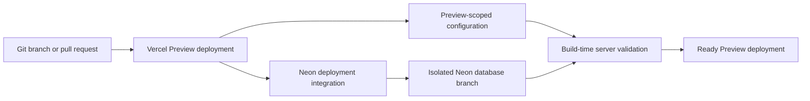

# Staging on Vercel

This project uses **Vercel Preview deployments as its staging environment**. Every non-production deployment gets the same server-side configuration contract as production, but it uses Preview-scoped secrets and an isolated Neon database branch.

This document describes the setup for the Vercel project `hbmartins-projects/raffy-research`, explains the build failure that prompted it, and provides repeatable verification and recovery procedures.

## Goals

The staging setup must:

- build with the same production-mode validation used by a production deployment;
- keep authentication secrets separate from production;
- prevent Preview deployments from connecting to the production database;
- give every Preview deployment its own Neon database branch;
- derive the correct deployment URL during both the Vite build and server-side runtime;
- identify telemetry as `preview`, not `production`; and
- fail the deployment when its database resource is unavailable.

The setup intentionally does not bypass environment validation. A deployment that cannot start safely should fail during the build rather than become a broken or unsafe Preview deployment.

## Environment model

| Git/deployment source | Vercel environment | Application environment | Database |
| --- | --- | --- | --- |
| Production branch | Production | `production` | Production Neon branch |
| Any non-production branch or pull request | Preview | `preview` | Isolated Neon branch for that deployment |
| Local development | Development/local | `development` | Developer database or Neon development connection |

In this model, “staging” means the Vercel **Preview** environment. It is not one long-lived server. Each branch or pull request receives a disposable staging deployment and database branch.



## Why the build failed

The reported error was:

```text
AUTH_SECRET: Invalid input: expected string, received undefined
```

The project validates server configuration during every production build. The relevant scripts are equivalent to:

```text
pnpm build
  -> NODE_ENV=production pnpm env
  -> env:server
  -> src/modules/kernel/infrastructure/config/server.ts
  -> validateServerConfig()
```

`validateServerConfig()` eagerly parses the authentication, database, telemetry, logger, and cache configuration. Therefore, all required server variables must exist before Vite starts compiling the application.

`AUTH_SECRET` existed in the Vercel **Production** scope, but the failing branch deployment ran in the **Preview** scope. Vercel does not make Production-only variables available to Preview deployments. Once `AUTH_SECRET` was fixed, the same validation would also require a Preview database URL and a production-mode OpenTelemetry collector URL.

Do not solve this failure by setting `SKIP_ENV_VALIDATION` on Vercel. That would hide the build-time error while leaving the deployed server without required configuration.

## One-time Vercel project setup

### 1. Link the local checkout

Link the repository to the existing Vercel project:

```bash
vercel link --yes \
  --project raffy-research \
  --scope hbmartins-projects
```

This creates the ignored `.vercel/` metadata directory. Depending on the CLI version and existing link state, linking or pulling environment variables can also update `.env.local`; preserve local-only values before running it.

Confirm the link:

```bash
vercel project inspect raffy-research --scope hbmartins-projects
```

### 2. Expose Vercel system environment variables

In the Vercel dashboard, open:

```text
Project Settings -> Environment Variables
```

Enable automatic exposure of Vercel system environment variables. The application uses those variables to determine the Preview deployment URL.

Vite only exposes variables prefixed with `VITE_` to build-time client code. Vercel also provides unprefixed system variables to the server runtime. The application supports both forms; see [Preview base URL resolution](#preview-base-url-resolution).

### 3. Add Preview-scoped configuration

Add the following variables to the **Preview** environment. Secrets must be entered through the Vercel dashboard or CLI and must not be committed to the repository.

“Required” in this table means required by this staging policy. Some values have application defaults, but setting them explicitly keeps Preview behavior visible and prevents a provider change from silently changing staging.

| Variable | Required | Visibility | Preview value/source | Purpose |
| --- | --- | --- | --- | --- |
| `AUTH_SECRET` | Yes | Secret | A unique random value of at least 32 characters | Signs and encrypts Better Auth state |
| `AUTH_PROVIDER` | Yes | Config | `better-auth` | Selects the authentication adapter |
| `DATABASE_URL` | Yes | Secret, integration-managed | Injected by the Neon integration | Connects the deployment to its isolated database branch |
| `DATABASE_DRIVER` | Yes | Config | `neon-http` | Selects the Neon HTTP database adapter |
| `OTEL_COLLECTOR_URL` | Yes | Secret | A valid `https://` collector endpoint | Required because Vercel builds run with `NODE_ENV=production` |
| `OTEL_ENVIRONMENT` | Yes | Config | `preview` | Labels server telemetry |
| `VITE_OTEL_ENVIRONMENT` | Yes | Config | `preview` | Labels browser telemetry |
| `VITE_ENV_NAME` | Yes | Config | `preview` | Labels the client application environment |

Generate a Preview-only authentication secret without printing or committing a shared production secret:

```bash
openssl rand -base64 48 | \
  vercel env add AUTH_SECRET preview --sensitive --yes \
  --scope hbmartins-projects
```

Add non-secret configuration with the dashboard or CLI. For example:

```bash
printf '%s' 'better-auth' | \
  vercel env add AUTH_PROVIDER preview --no-sensitive --yes \
  --scope hbmartins-projects

printf '%s' 'neon-http' | \
  vercel env add DATABASE_DRIVER preview --no-sensitive --yes \
  --scope hbmartins-projects

printf '%s' 'preview' | \
  vercel env add OTEL_ENVIRONMENT preview --no-sensitive --yes \
  --scope hbmartins-projects

printf '%s' 'preview' | \
  vercel env add VITE_OTEL_ENVIRONMENT preview --no-sensitive --yes \
  --scope hbmartins-projects

printf '%s' 'preview' | \
  vercel env add VITE_ENV_NAME preview --no-sensitive --yes \
  --scope hbmartins-projects
```

Add `OTEL_COLLECTOR_URL` as a sensitive Preview value. Prefer a staging collector. If Preview and Production must temporarily share a collector, the `preview` environment labels are essential for filtering and alerting.

Do not add `DATABASE_URL` manually when the Neon integration is managing it. A manual project variable can shadow the deployment-specific URL and accidentally send Preview traffic to the wrong database.

Inspect variable names and scopes without exposing values:

```bash
vercel env ls preview --scope hbmartins-projects
```

### 4. Configure the Neon integration

The Vercel project uses the `neon-teal-flame` storage resource. In the Vercel dashboard, open the resource connection for `raffy-research` and update it with these settings:

| Setting | Required value |
| --- | --- |
| Connected environments | Production, Preview, Development |
| Require Active Resource Before Deploy | Required |
| Create database branch for deployment | Preview enabled |

The approximate dashboard path is:

```text
Project -> Storage -> neon-teal-flame -> Projects/Connections
  -> raffy-research -> Update Project Connection
```

This configuration makes the integration inject `DATABASE_URL` and its related PostgreSQL variables into Preview deployments. With Preview database branching enabled, a Preview deployment receives a deployment-specific Neon branch instead of the production branch.

Requiring an active resource makes the deployment wait for the Neon branch and fail if provisioning fails. This is safer than deploying an application whose database URL is missing or points somewhere unexpected.

Verify the linked resource from the CLI:

```bash
vercel storage status --scope hbmartins-projects
```

### 5. Redeploy after configuration changes

Environment variables are captured when a deployment is created. Changing project configuration does not rewrite an existing deployment. Redeploy the failed deployment or create a new commit:

```bash
vercel redeploy <failed-deployment-url> --scope hbmartins-projects
```

Use the URL of the failed Preview deployment, not the production deployment.

## Preview base URL resolution

Authentication needs the deployment's public origin for callbacks, trusted origins, and redirects. Preview URLs differ for every deployment, so a single global `VITE_BASE_URL` is not sufficient.

The base URL resolver in `src/platform/env/config.ts` uses this behavior:

1. Determine the Vercel environment from `VITE_VERCEL_ENV`, then `VERCEL_ENV`.
2. Only when that value is `preview`, select the first non-empty URL from:
   1. `VITE_VERCEL_BRANCH_URL`
   2. `VERCEL_BRANCH_URL`
   3. `VITE_VERCEL_URL`
   4. `VERCEL_URL`
3. Prefix the selected Vercel hostname with `https://`.
4. In all other cases, use the explicitly configured `VITE_BASE_URL`.

The prefixed variables support Vite build-time code. The unprefixed variables are required for server-side runtime code because Vercel does not guarantee that `VITE_*` system variables are present in the function runtime.

Production deliberately continues to use an explicit canonical `VITE_BASE_URL`. It should not switch between generated deployment hostnames because production authentication callbacks and canonical links need a stable origin.

Do not configure a single project-wide Preview `VITE_BASE_URL` unless all Preview deployments intentionally share one externally routed hostname. Otherwise, callbacks from one branch can be sent to another branch's deployment.

Regression coverage lives in `tests/unit/platform/env/config.unit.spec.ts`. It covers Vite-prefixed Preview variables, unprefixed server-runtime variables, and the deployment URL fallback used when no branch URL is available.

## Optional provider configuration

The variables above are enough to satisfy the core server configuration, but a feature can still require its own Preview credentials.

### OAuth providers

If GitHub sign-in is enabled, create a separate staging OAuth application and add its client ID and secret only to the Preview scope. Its callback URL must match the Preview domain strategy.

Dynamic per-deployment domains are usually incompatible with providers that require an exact, pre-registered callback URL. In that case, use one of these approaches:

- use email authentication for arbitrary Preview deployments;
- route a stable staging domain to a designated staging branch; or
- configure a provider-supported callback broker.

Do not reuse production OAuth credentials merely to make Preview sign-in work.

### Trusted hosts and origins

The authentication configuration includes the resolved base URL automatically. Add `AUTH_ALLOWED_HOSTS` or `AUTH_TRUSTED_ORIGINS` only when an additional host or application scheme must be trusted, such as a stable staging domain or a mobile callback scheme.

Keep the lists narrow. Do not add unrestricted wildcards solely to silence an origin error.

### Feature-specific services

Add Preview-scoped values for any feature exercised in staging, such as email, object storage, error reporting, AI providers, or webhook verification. Prefer sandbox accounts and isolated buckets/tenants. A Preview deployment should not send real customer email, mutate production storage, or consume production webhooks by default.

Never prefix a secret with `VITE_`; Vite-prefixed values can be embedded in browser assets.

## Database schema and data behavior

A Neon Preview branch starts from the configured parent branch at provisioning time. It isolates subsequent writes, but its initial schema and data reflect that parent branch.

Important consequences:

- Preview writes do not mutate the production branch.
- A new deployment can receive a fresh database branch even when the application code is unchanged.
- The current `pnpm build` command does not run database migrations.
- A change that requires a new schema must apply versioned migrations to the Preview branch through an explicit, reviewed deployment or CI step.
- Never work around a missing Preview schema by substituting the production `DATABASE_URL`.

If staging data needs stronger separation than branch-on-production provides, configure Neon to branch from a sanitized staging parent instead of the production parent.

## Verification procedure

### 1. Verify configuration scopes

```bash
vercel env ls preview --scope hbmartins-projects
vercel storage status --scope hbmartins-projects
```

Confirm that the required names exist in Preview and that the Neon resource is connected to Preview. Do not print secret values into a terminal recording, CI log, or issue.

### 2. Create or redeploy a Preview deployment

The normal path is to push a non-production branch or update a pull request. A direct CLI deployment can also be used for diagnosis:

```bash
vercel deploy --scope hbmartins-projects
```

Wait for the deployment to reach `Ready`, then inspect it:

```bash
vercel inspect <preview-deployment-url> --scope hbmartins-projects
```

### 3. Smoke-test the server

Use Vercel's authenticated request command when deployment protection is enabled:

```bash
vercel curl <preview-deployment-url>/ --scope hbmartins-projects
vercel curl <preview-deployment-url>/login --scope hbmartins-projects
vercel curl <preview-deployment-url>/api/auth/get-session \
  --scope hbmartins-projects
```

Expected results:

- `/` redirects to `/login` for an unauthenticated user;
- `/login` returns a successful HTML response; and
- `/api/auth/get-session` returns a successful response, usually with an empty session for an unauthenticated request.

Inspect runtime logs after the smoke test:

```bash
vercel logs <preview-deployment-url> --scope hbmartins-projects
```

Look for configuration validation errors, database connection failures, authentication callback errors, function timeouts, and unexpected production telemetry labels.

### 4. Run repository checks

For a staging-related code change, use the repository's normal verification loop:

```bash
pnpm format:changed
pnpm check
pnpm test:affected
pnpm build
```

Before a merge-level handoff, run:

```bash
pnpm verify
```

### 5. Optional local Vercel build

`vercel env pull` can redact sensitive values as `[SENSITIVE]`. A local `vercel build --target preview` can therefore fail even when the remote Preview deployment has valid secrets.

For local build validation only, supply disposable values in the process environment:

```bash
AUTH_SECRET='local-preview-build-validation-only-1234567890' \
OTEL_COLLECTOR_URL='https://otel.example.invalid' \
vercel build --yes --target=preview --scope hbmartins-projects
```

These placeholders are for a local compile check only. Never upload them to Vercel and never use them for a reachable deployment.

## Troubleshooting

| Symptom | Likely cause | Resolution |
| --- | --- | --- |
| `AUTH_SECRET` is `undefined` | The variable exists only in Production or Development | Add a unique secret to Preview and redeploy |
| `AUTH_SECRET` is too short or rejected as a placeholder | A weak value or the literal `[SENSITIVE]` redaction reached local validation | Generate a value of at least 32 characters; use a disposable process override for local builds |
| `DATABASE_URL` is `undefined` | The Neon resource is not connected to Preview, branch provisioning failed, or a manual variable shadows the integration | Correct the resource connection, require active provisioning, remove the shadowing variable, and redeploy |
| `OTEL_COLLECTOR_URL` is `undefined` | Vercel builds run with `NODE_ENV=production`, which makes the collector URL required | Add a valid `https://` URL to Preview and redeploy |
| Base URL is missing during SSR | Unprefixed Vercel runtime variables are unavailable, automatic system variables are disabled, or the URL resolver change is not deployed | Enable system variables and verify `VERCEL_ENV` plus `VERCEL_BRANCH_URL`/`VERCEL_URL` |
| Auth redirects to another Preview deployment | A static Preview `VITE_BASE_URL` was configured globally | Remove it and allow per-deployment Vercel URL resolution, or use a designated stable staging branch/domain |
| Deployment is `Ready`, but a route returns `500` | Build-time validation passed, but a runtime provider, schema, callback, or server rendering path failed | Reproduce with `vercel curl`, then inspect runtime logs for the same request |
| `Serialization timeout after app render finished` appears | A TanStack server rendering/stream serialization path did not settle after the response render | Treat this as a separate runtime issue; capture the route, request logs, and production comparison rather than changing `AUTH_SECRET` |

## Security and data-safety rules

- Use a distinct `AUTH_SECRET` for Preview. Never copy the production secret.
- Keep Preview database branching enabled. Never manually point Preview at the production database to unblock a build.
- Use sandbox credentials for email, OAuth, storage, AI, payments, and webhooks whenever possible.
- Store secrets as sensitive Vercel variables and never give them a `VITE_` prefix.
- Keep Preview deployment protection enabled when previews contain non-public data or unfinished features.
- Rotate a secret immediately if it appears in a commit, command history shared with others, CI output, screenshot, or support ticket.
- Log the presence and scope of configuration when diagnosing issues, not secret values.
- Do not set `SKIP_ENV_VALIDATION` on Preview deployments.

## Long-lived staging branch option

If the team later needs one stable staging URL for OAuth callbacks or external QA, designate a branch such as `staging` and assign it a stable Vercel branch domain. Keep it in the Vercel Preview environment so it retains Preview isolation.

Branch-specific variables can be added with:

```bash
vercel env add <NAME> preview \
  --git-branch=staging \
  --scope hbmartins-projects
```

Use branch-specific overrides only for values that genuinely differ from other Preview deployments, such as a stable base URL or OAuth client. The shared Preview configuration and Neon isolation rules should remain the default.

## Rollback and removal

Remove an incorrectly scoped Preview variable with:

```bash
vercel env rm <NAME> preview --scope hbmartins-projects
```

Then redeploy. Existing deployments retain the environment snapshot created for them; changing or removing a project variable does not mutate that snapshot.

To stop provisioning Preview database branches, update the Neon project connection and remove Preview from the deployment-branch setting. This reduces isolation and can make Preview builds fail if no other Preview database URL exists, so perform that change only as an intentional infrastructure rollback.

If the base URL resolver must be rolled back, every Preview deployment will need an explicit, correct `VITE_BASE_URL`. That is less reliable for branch previews and is not the recommended steady state.

## Setup checklist

- [ ] The repository is linked to `hbmartins-projects/raffy-research`.
- [ ] Vercel system environment variables are automatically exposed.
- [ ] Preview has its own strong `AUTH_SECRET`.
- [ ] Preview sets `AUTH_PROVIDER=better-auth`.
- [ ] Preview sets `DATABASE_DRIVER=neon-http`.
- [ ] Neon is connected to Production, Preview, and Development.
- [ ] Neon creates a database branch for Preview deployments.
- [ ] Vercel requires the Neon resource to be active before deployment.
- [ ] Preview has a valid `OTEL_COLLECTOR_URL`.
- [ ] Server and browser telemetry environments are set to `preview`.
- [ ] Client environment name is set to `preview`.
- [ ] Preview-specific provider credentials use sandbox or staging accounts.
- [ ] A new Preview deployment builds successfully.
- [ ] `/`, `/login`, and `/api/auth/get-session` pass the smoke test.
- [ ] Runtime logs show no config, database, or authentication failures.

## References

- [Vercel environment variables](https://vercel.com/docs/environment-variables)
- [Managing Vercel environment variables](https://vercel.com/docs/environment-variables/managing-environment-variables)
- [Vercel system environment variables](https://vercel.com/docs/environment-variables/system-environment-variables)
- [Vite on Vercel](https://vercel.com/docs/frameworks/frontend/vite)
- [Vercel deployment integration actions](https://vercel.com/docs/integrations/create-integration/deployment-integration-action)
- [Neon and Vercel native integration](https://neon.com/blog/neon-vercel-native-integration)
- [Neon manual Vercel setup](https://neon.com/docs/guides/vercel-manual)
